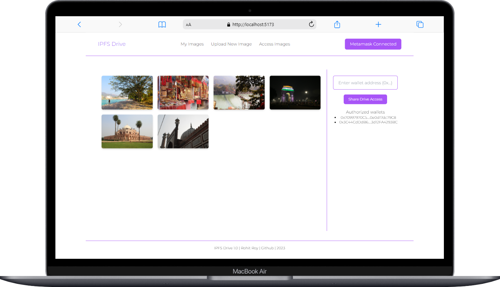
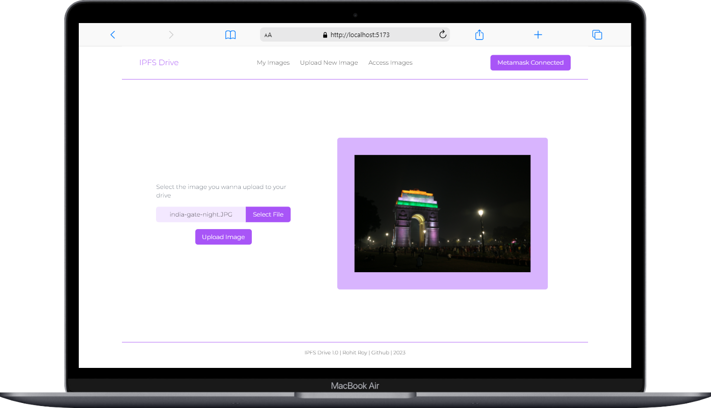
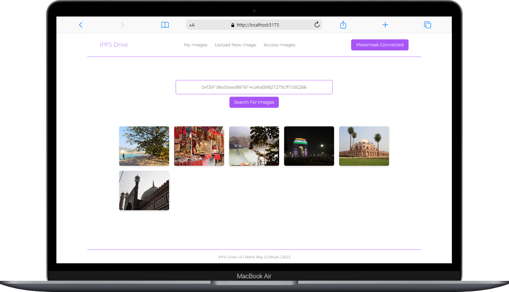

<h2>IPFS Drive (EVM Based)</h2>

<b>This is a decentralized version of Google Drive for storing photos powered by Blockchain & IPFS.</b>

Currently, the app is working on localhost using <b>Sepolia</b> test network and Alchemy endpoint.

<h3><b>Snapshots from the project :</b></h3>

<h3><b>Project Features :</b></h3>

<ul>
    <li>Uploading pictures</li>
    <li>Storing pictures to IPFS</li>
    <li>Sharing drive access for the files to other Web3 users (Wallets)</li>
</ul>

<h3><b>Tech Stack :</b></h3>

<b>Frontend :</b>

<ul>
    <li>Vite JS</li>
    <li>Tailwind CSS</li>
</ul>

<b>Backend :</b>

<ul>
    <li>Node JS</li>
    <li>Hardhat Development Environment</li>
    <li>Metamask Wallet</li>
    <li>Ethers JS</li>
    <li>Alchemy</li>
    <li><a href="https://www.pinata.cloud/">Pinata IPFS</a></li>
</ul>

<h3><b>Guide for testing on local hardhat network :</b></h3>

<b>Environment variables :</b>

Create a new .env file inside [blockchain-hardhat] folder taking reference from .env.example file inside the same.

<b>Backend :</b>

Terminal 1:

<ul>
    <li>Run (Move inside [blockchain-hardhat] folder) : <b>cd blockchain-hardhat</b></li>
    <li>Run (Running Hardhat node locally) : <b>npx hardhat node</b></li>

</ul>

Terminal 2:

<ul>
    <li>Run (Move inside [blockchain-hardhat] folder) : <b>cd blockchain-hardhat</b></li>
    <li>Run (Running tests) : <b>npx hardhat test</b></li>
    <li>Run (Running deployment script) : <b>npx hardhat run scripts/deploy[IPFSDriveContract_Main].js --network localhost</b></li>
</ul>

Update the <b>[backend-config.json]</b> file inside /frontend-vite with the updated contract-address under <b>"31337"</b> "address" feild fetched from Terminal 2.

<b>Frontend :</b>

Terminal 1:

<ul>
    <li>Run (Move inside [frontend-vite] folder) : <b>cd frontend-vite</b></li>
    <li>Run (Running frontend on browser): <b>npm run dev</b></li>
</ul>

The project is complete but I'm open to suggestions & modifications for this project. Please don't forget to put a ⭐ if you like the project.
